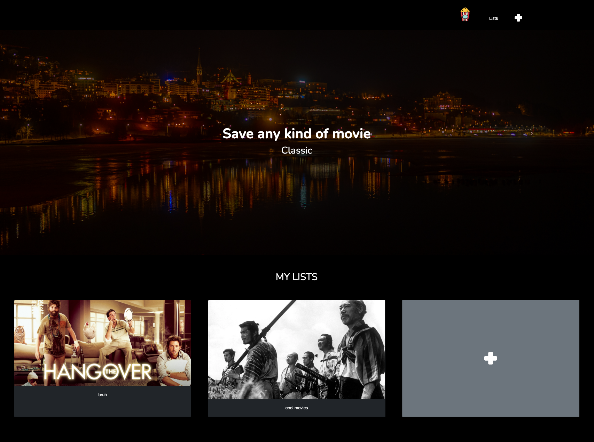

# Watch List

Create custom movie collections and bookmark your favorites 🎬


## Preview




## What it is

A movie watch list application where users can create custom lists and bookmark their favorite movies.

## Features

- **View all lists** - See all your movie collections
- **Create lists** - Make themed collections (Drama, Comedy, Classics, etc.)
- **List details** - View movies in each list with comments
- **Bookmark movies** - Add movies to your lists with personal notes
- **Delete bookmarks** - Remove movies from lists
- **Movie database** - Pre-seeded with movies from TMDB API

## How it works

A 3-model Rails app with a many-to-many relationship:
- **Lists** - User-created collections
- **Movies** - Pre-seeded movie database
- **Bookmarks** - Join table connecting movies to lists with comments

## Technologies

- Ruby on Rails
- PostgreSQL
- Bootstrap 5
- Simple Form
- TMDB API (for movie data)

## Setup
```bash
bundle install
rails db:create db:migrate db:seed
rails server
```

Visit `http://localhost:3000`

## Database Schema

- `lists` - name
- `movies` - title, overview, poster_url, rating
- `bookmarks` - movie_id, list_id, comment

## Files

- `app/models/` - List, Movie, Bookmark models
- `app/controllers/` - Lists and Bookmarks controllers
- `app/views/` - List views and bookmark forms
- `db/seeds.rb` - Movie database seed

## Challenge

[Le Wagon Watch List Challenge](https://github.com/lewagon/fullstack-challenges)
